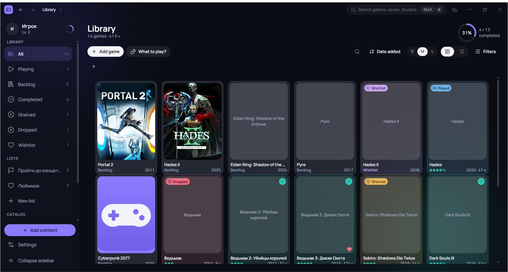
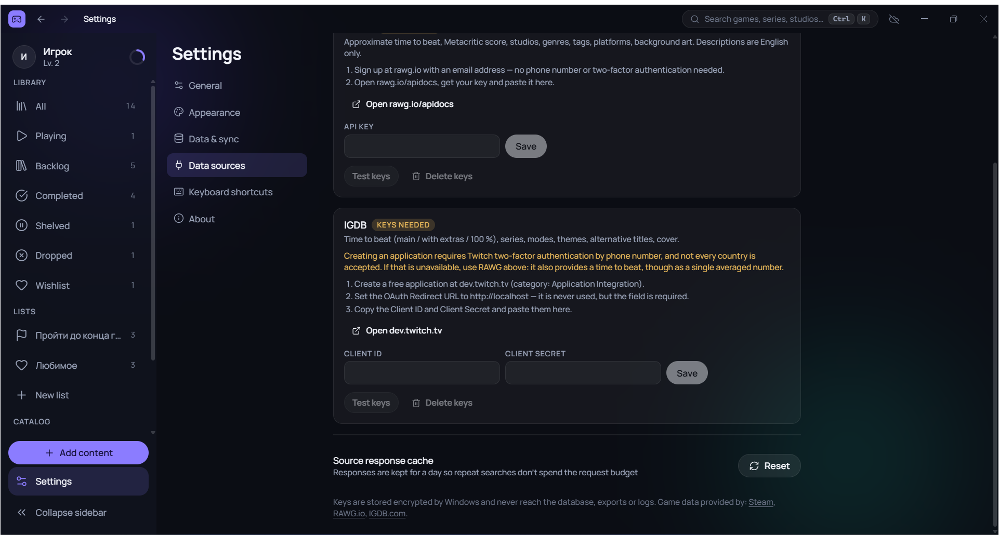
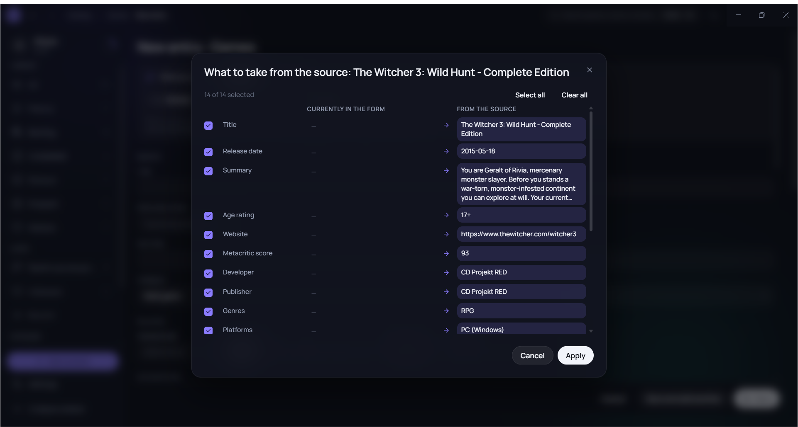
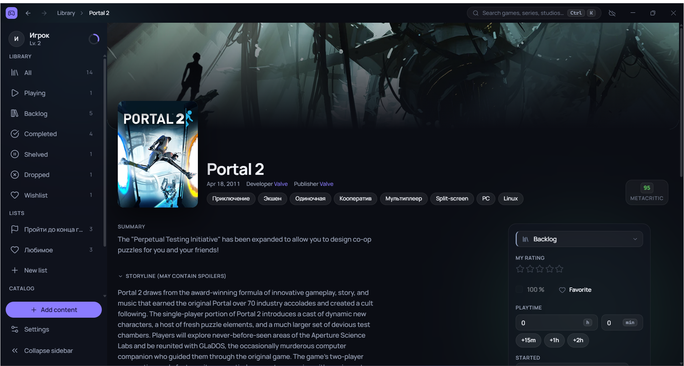

# Backlog

A personal, offline-first desktop app for keeping track of a video game backlog — what you own,
what you're playing, what you finished and how long it took. Windows, portable, all data in a
single local SQLite file next to the executable.

Non-commercial hobby project. No store listing, no monetization, no ads, no accounts,
no telemetry, no server side of any kind.



## Contents

- [What it does](#what-it-does)
- [Data sources and attribution](#data-sources-and-attribution)
- [How RAWG is used](#how-rawg-is-used)
- [Screenshots](#screenshots)
- [Tech stack](#tech-stack)
- [Building from source](#building-from-source)
- [Project layout](#project-layout)
- [Status](#status)

## What it does

- **Library and statuses** — playing / backlog / completed / shelved / dropped / played / wishlist,
  ratings, playtime, priorities, personal notes and reviews.
- **Collections** — 22 filter sections with live facet counts, saved filter presets, grid and
  table views, grouping and sorting.
- **Catalog** — games, studios and publishers, series, genres, platforms, tags; deduplication
  and merge tools.
- **Lists** — hand-ordered lists with covers and progress rings.
- **Profile** — statistics, activity log, achievements and levels.
- **Backups** — local zip backups, full export/import, optional sync to the user's own Google Drive.
- **Bilingual UI** — Russian and English.

Everything can be typed in by hand. Filling a game card from an external source is optional
and always triggered by the user.

## Data sources and attribution

The app can pre-fill a game card from three sources. Which one is used is the user's choice,
and every request happens **only in response to an explicit user action** — typing a query and
pressing "Search", or opening one search result.

| Source | Access | What it provides |
|---|---|---|
| [Steam Store API](https://store.steampowered.com/api/appdetails) | no key required | title, description, developer/publisher, genres, modes, platforms, release date, age rating, Metacritic score, cover / hero art / logo |
| [RAWG.io](https://rawg.io/apidocs) | the user's own API key, entered in the app | approximate time to beat, Metacritic score, studios, genres, tags, platforms, background art |
| [IGDB](https://api-docs.igdb.com/) | the user's own Twitch application credentials | time to beat (main / extras / 100 %), series, modes, themes, alternative titles, cover |

**Attribution is displayed inside the app**, as required by the RAWG free tier:

- Settings → Data sources shows *"Game data provided by: Steam, RAWG.io, IGDB.com"*, each a link
  that opens the corresponding site.
- Every game card whose data came from a source shows *"Data from: RAWG.io (8 Sep 2026)"* in its
  footer, linking back to that game's page on the source site.



**Keys** are entered by each user for their own account. They are encrypted with the Windows
data protection API (`safeStorage` / DPAPI) and stored in `data/providers/credentials.bin`.
They never enter the database, the exported archive, the logs, or the renderer process — and
they are obviously not in this repository. There is no shared or embedded key anywhere in the code.

**Scraping is not used anywhere.** HowLongToBeat, Metacritic and SteamDB have no public API and
their terms forbid scraping, so the app does not touch them: the completion-time estimate comes
from RAWG or IGDB, and the Metacritic score comes from the field Steam publishes in its own API.
A pasted `steamdb.info/app/<id>` link is only parsed to extract the numeric app id, after which
Steam's own API is queried.

## How RAWG is used

Implementation: [`src/main/providers/rawg.ts`](src/main/providers/rawg.ts).

- **Endpoints:** `GET /api/games?search=…&page_size=…` for the result list, `GET /api/games/{id}`
  for the card the user picked. Nothing else.
- **Volume:** two requests per imported game at most. There is no crawler, no background job,
  no bulk download and no attempt to mirror the RAWG database. A typical session is a handful
  of requests.
- **Rate limiting:** a token bucket in [`rate-limit.ts`](src/main/providers/rate-limit.ts) caps
  the app at 5 requests per second, well under the free-tier monthly budget.
- **Caching:** responses are cached locally for 24 hours
  ([`cache.ts`](src/main/providers/cache.ts)) so repeating a search costs nothing.
- **Storage:** only the fields the user ticks in the import dialog are written, into that user's
  own local SQLite file. The raw response is kept alongside the record so a re-import can tell
  whether anything actually changed.
- **Where requests come from:** the Electron main process only. The renderer has
  `connect-src 'none'` in its Content Security Policy and never talks to the network, so keys
  cannot leak into the UI layer.

## Screenshots

Filling a game card from a source — the user picks field by field what to take, and sees what
will be created in their catalog:



A finished game card, with the source attribution in the footer:



## Tech stack

Electron 44 · electron-vite 5 · React 19 · TypeScript 5.9 · Tailwind CSS 4 ·
TanStack Router / Query / Table / Virtual · zustand · motion · better-sqlite3 (WAL + FTS5) ·
zod · i18next · vitest.

Architecture notes:

- Main process is the backend: SQLite, business logic, all HTTP. Renderer is pure UI.
- Every IPC channel is declared once in [`src/shared/ipc-contract.ts`](src/shared/ipc-contract.ts)
  with zod schemas for input and output; preload generates the bridge from that contract.
- `sandbox: true`, context isolation on, no node integration in the renderer, strict CSP,
  Electron fuses applied to the packaged binary.
- Portable: `backlog.config.json` next to the executable points at the data folder;
  nothing is written to the registry or to `%APPDATA%`.

## Building from source

```bash
npm install
npm run dev
```

| Script | What it does |
|---|---|
| `npm run dev` | development mode with HMR |
| `npm run build` | typecheck + build into `out/` |
| `npm run dist` | portable build: `electron-builder --dir` + zip of `dist/win-unpacked` |
| `npm test` | unit and integration tests (vitest, in-memory SQLite) |
| `npm run typecheck` | `tsc` over the three configurations |
| `npm run lint` / `npm run format` | eslint / prettier |
| `npm run check:tokens` | verifies components use design tokens, not literal colors |
| `npm run check:i18n` | verifies every `t('…')` key exists in both dictionaries |

The route `/dev/ui` is a component gallery showing every design-system component in all states.

## Project layout

```
src/
├── main/        Electron main = backend: SQLite, services, IPC, providers, sync, backups
│   └── providers/   external sources: steam.ts, rawg.ts, igdb.ts, cache, rate limiting
├── preload/     contextBridge, one method per contract channel
├── shared/      constants, zod schemas, ipc-contract.ts, text utilities
└── renderer/    React + Tailwind: shell, design system, screens
docs/            specification (00–10) and architecture decision records
scripts/         icon generation, portable packaging, token and i18n checks
tests/           Electron stubs and shared test helpers
```

## Status

In active development, used daily by its author. The interface and documentation are written
in Russian; the UI also ships an English translation.

Personal project, all rights reserved — see `package.json`. Game data belongs to the respective
sources listed above.
